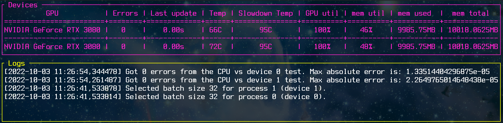

# torch-stress

`torch-stress` is a simple tool that stresses a
[PyTorch](https://pytorch.org/) device (CUDA GPU) and tests its stability.

## Screenshot



## Installation & Usage

Create an environment, install dependencies and activate the environment:

```bash
conda env create -f environment.yml
conda activate torch-stress
```

Alternatively, if you have `torch` and `torchvision` installed in one of your
environments, install the remaining dependencies:

```bash
pip install nvidia-ml-py==11.515.75 urwid==2.1.2 texttable==1.6.4
```

Run the tool with:

```bash
python -m torch_stress.main
```

It will start a load process for each avaiable CUDA device immediately.

## How it works

Each process generates load for the GPU by simulating the training loop for a
[Vision Transformer](https://pytorch.org/vision/main/models/generated/torchvision.models.vit_b_16.html#torchvision.models.ViT_B_16_Weights)
model with pretrained weights. Either internet access is required, or you have
to copy the pretrained weights manually.

The tool searches for a largest batch size by increasing it until the device
memory runs out. Then it displays the maximum absolute error between the outputs
of the same model computed on that device versus computed on the CPU. Finally, it
saves the outputs from the first forward pass, and continuously computes the forward
and backward passes, each time checking if the computed model output are the same.

A value larger than 0 in the 'Errors' column may indicate that the device is faulty
or unstable. The tool also displays some statistics about the GPU such as load,
temperature etc. Only NVIDIA devices are supported.

The tool runs for a few minutes by default, and you can change this with the `--runtime`
argument. Press `Q` to stop the tool and exit.

## Disclaimer

You use this tool on your own risk.